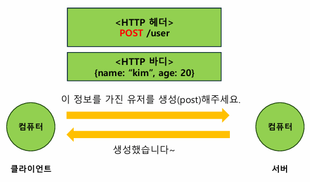
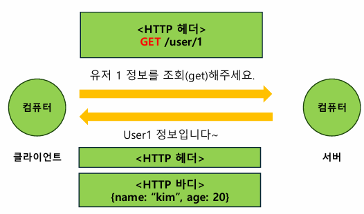
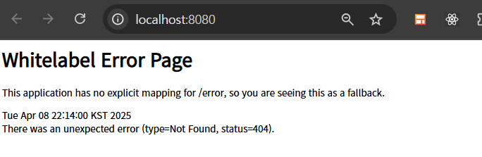

## 웹

여러 컴퓨터가 서로 연결되어 정보를 공유하는 공간

## 클라이언트-서버

클라이언트 : 데이터의 생성/조회/수정/삭제 요청 전송  
서버 : 요청대로 동작 수행, 응답 전송

## HTTP

프로토콜 : 네트워크 안에서 요청과 응답을 보내는 규칙  
HTTP : 웹에서 데이터를 주고받는 규칙(프로토콜)

### HTTP Method

데이터를 다루는 방법

- GET : 데이터 가져옴 (조회)
- POST : 데이터 게시 (생성)
- PUT : 데이터 없으면 생성, 있으면 교체 (수정) // 중복 생성 X
- PATCH : 데이터 일부분 수정 (수정)
- DELETE : 데이터 삭제 (삭제)

### URL

다룰 데이터의 위치

- http://www.example.com/user/1/nickname  
  프로토콜(scheme) / 서버주소(domain) / 서버 내 데이터 위치(path)
- **Path Parameter**  
  http://www.example.com/user/{user_id}/nickname  
  { } 사용
- **Query String**  
  http://~.com/post/search?page-1&keyword=hello  
  path 뒤 ? (key-value 형식)

### HTTP 헤더 & 바디

헤더  
: 통신에 대한 정보 (언제 누가 보냈는지, HTTP method 종류, 요청 경로, 상태코드 ..)

- 상태 코드  
  200 -> ok (처리 성공)  
  201 -> created (데이터 생성 성공)  
  400 -> bad request (클라이언트 요청 오류)  
  404 -> not found (요청 데이터 없음)  
  500 -> internal server error (서버 에러)

바디  
: 주고 받으려는 데이터 (주로 json 형식)

 

## 프론트엔드-백엔드

프론트(클라이언트)  
: 화면에 채울 컨텐츠 데이터 백에게 요청

백(서버)  
: DB에서 가져온 컨텐츠 데이터를 프론트에게 응답

## API

어플리케이션에서 원하는 기능을 수행하기 위해 어플리케이션과 소통하는 방법(창구)을 정의한 것

### 백엔드 API

프론트가 백엔드에 요청 보낼 때,

- 어떤 http method, url을 사용해야 하는지 정의
- 각 요청에 대해 어떤 응답을 보내는지 정의

### REST API

REST 아키텍쳐를 따르도록 설계한 API

- URL : 조작할 데이터
- HTTP method : 데이터에 대한 행위

&nbsp;

---

&nbsp;

### 과제 (API 설계)

회원가입 : POST /signup  
로그인 : POST /login

할 일 전체 조회 : GET /todos  
할 일 생성 : POST /todos  
할 일 수정 : PATCH /todos/{todo_id}  
할 일 삭제 : DELETE /todos/{todo_id}  
할 일 체크 : POST /todos/{todo_id}/check  
할 일 체크해제 : POST /todos/{todo_id}/uncheck

친구 찾기 : GET /user/search  
팔로우 : POST /user/{user_id}/follow  
언팔로우 : DELETE /user/{user_id}/unfollow  
친구 리스트 조회 : GET /user/friends  
친구의 할 일 조회 : GET /user/{user_id}/todos

&nbsp;

