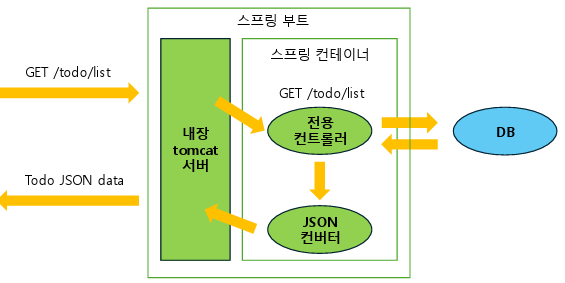
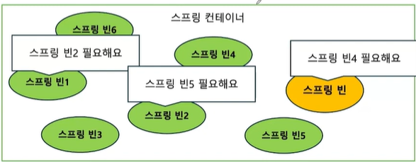
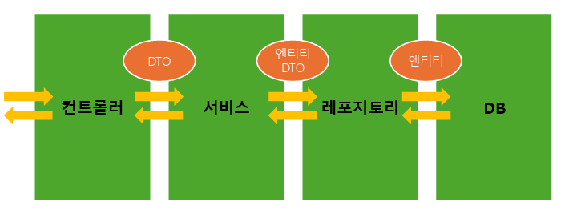
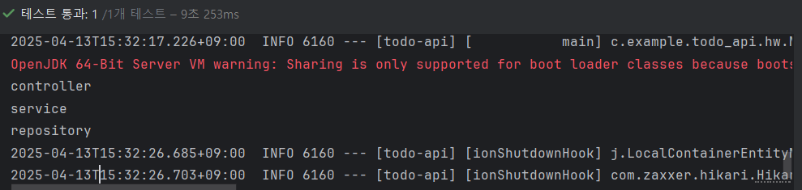

## 스프링 애플리케이션 구조



## 스프링 빈 & 스프링 컨테이너(Application Context)

스프링 빈 : 어플리케이션 전역에서 공동으로 사용하는 하나의 공용 객체  
스프링 컨테이너 : 스프링 빈(객체)을 저장하는 공용 공간



## 스프링 빈 저장

### 설정 파일 작성 (수동)

명시적으로 등록할 기능을 하나의 별도의 설정 파일에 몰아서 작성  
**@Configuration** : 클래스, **@Bean** : 메소드  
_ApplicationContext_ -> 컨테이너 생성

```java
// TestConfig.java
package com.example.todo_api.bean;

import org.springframework.context.annotation.Bean;
import org.springframework.context.annotation.Configuration;

@Configuration
public class TestConfig {

    @Bean       // 반환 객체 = 스프링 빈으로 등록될 객체
    public MyBean myBean(){
        return new MyBean();
    }
}
```

```java
// BeanTest.java
package com.example.todo_api.bean;

import org.assertj.core.api.Assertions;
import org.junit.jupiter.api.Test;
import org.springframework.context.ApplicationContext;
import org.springframework.context.annotation.AnnotationConfigApplicationContext;

public class BeanTest {

    ApplicationContext context = new AnnotationConfigApplicationContext(TestConfig.class);  // context 생성

    @Test
    public void getAllBeanTest(){
        // 설정 파일 정보를 이용해서 스프링 컨테이너 생성, 스프링 컨테이너 내 모든 빈 조회
        for(String name : context.getBeanDefinitionNames()){
            System.out.println(name);
        };

        // Context 안에 MyBean 유무 검증 (코드로 자동화)
        Assertions.assertThat(context.getBeanDefinitionNames()).contains("myBean");
    }

    @Test
    // 스프링 컨테이너에 들어 있는 객체는 하나
    public void getOneBeanTest(){
        MyBean myBean1 = context.getBean(MyBean.class);  // .class -> 스프링 객체 타입으로 가져옴
        MyBean myBean2 = context.getBean(MyBean.class);
        MyBean myBean3 = new MyBean();

        System.out.println(myBean1);    // 고유값 동일
        System.out.println(myBean2);    // 고유값 동일
        System.out.println(myBean3);    // 다름

        Assertions.assertThat(myBean1).isSameAs(myBean2);
    }
}
```

### 컴포넌트 스캔 (자동)

클래스의 표식 사용  
**_@Component_** : 빈을 생성할 클래스, **@ComponentScan** : 컴포넌트 스캔 (@Component가 붙은 클래스 찾아서 자동으로 빈 등록)

```java
// MyBean.java
package com.example.todo_api.bean;

import org.springframework.stereotype.Component;

@Component
public class MyBean {
}

```

```java
// TestConfig.java
@Configuration
@ComponentScan
public class TestConfig {

    @Bean       // 반환 객체 = 스프링 빈으로 등록될 객체
    public MyBean myBean(){
        return new MyBean();
    }
}
```

## 의존성 주입

프레임워크가 컨테이너에서 필요한 빈을 찾아 대신 넣어주는 것  
(두 객체 모두 스프링에 의해 관리 = 빈으로 등록되어 있어야 함)

- OCP 원칙
- 메모리 효율적으로 활용

통로 : 생성자, 필드, (메서드)  
**@Autowired** (생성자 하나일 때 생략 0)

### 생성자 주입

동작하는 어플리케이션 코드에서 사용

1. **final** 키워드 -> 필요한 의존성 추가 (생성자 통해 초기화)
2. **@RequiredArgsConstructor** -> 생성자 추가

```java
// MyBean.java
package com.example.todo_api.bean;

import lombok.Getter;
import lombok.RequiredArgsConstructor;
//import org.springframework.beans.factory.annotation.Autowired;
import org.springframework.stereotype.Component;

@Getter
@Component
@RequiredArgsConstructor
public class MyBean {

    private final MySubBean mySubBean;        // mySubBean 객체 필요로 하는 의존성 생성

//    @Autowired
    // 필드 초기화해주는 생성자 코드
//    public MyBean(MySubBean mySubBean){
//        this.mySubBean = mySubBean;
//    }

}
```

```java
// BeanTest.java
@Test
    public void dependencyInjection(){
        MyBean myBean = context.getBean(MyBean.class);
        MySubBean mySubBean = context.getBean(MySubBean.class);

        System.out.println(myBean.getMySubBean());
        System.out.println(mySubBean);

        Assertions.assertThat(myBean.getMySubBean()).isSameAs(mySubBean);
    }
```

### 필드 주입

테스트 코드에서 사용  
**@Autowired** -> final 사용 X  
테스트 실행 시 이미 스프링 컨테이너 & 빈 존재 필요

```java
// MyBean.java
package com.example.todo_api.bean;

import lombok.Getter;
import lombok.RequiredArgsConstructor;
import org.springframework.stereotype.Component;

@Getter
@Component
@RequiredArgsConstructor
public class MyBean {
    private final MySubBean mySubBean;
}
```

- **@SpringBoostTest** -> 어플리케이션에 있는 모든 빈을 컨테이너에 등록한 후 테스트 (스프링 부트까지 실행 -> 통합 테스트에도 사용 0)

```java
// BeanTest2.java
@SpringBootTest
public class BeanTest2 {

    @Autowired
    private MyBean myBean;      // 여기가 통로야

    @Autowired
    private MySubBean mySubBean;    // 여기가 통로야

    @Test
    public void dependencyInjection(){
        System.out.println(myBean.getMySubBean());
        System.out.println(mySubBean);

        Assertions.assertThat(myBean.getMySubBean()).isSameAs(mySubBean);
    }
}
```

## 스프링 계층 구조



컨트롤러  
: 클라이언트의 요청을 받고, 응답을 보내는 계층  
: DTO(Data Transfer Object)를 사용하여 *서비스 계층*과 데이터 주고받음

서비스  
: 어플리케이션의 비즈니스 로직(실제 처리해야할 일)이 담기는 계층  
: 레포지토리 계층과 소통하며 엔티티/DTO로 소통

레포지토리  
: DB와 소통하며 데이터 조작하는 계층  
: 서비스 계층이 결정한 비즈니스 로직을 실제 DB에 적용

DB  
: 어플리케이션 외부

---

### 스프링 빈 활용

컨트롤러, 서비스, 레포지토리는 스프링 빈으로 등록

- 매번 새로운 객체 생성할 필요 X
- 객체지향 원칙을 준수하며 의존성 관리 가능

&nbsp;

---

### 과제


