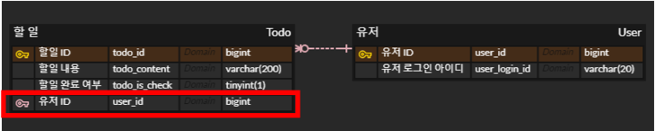
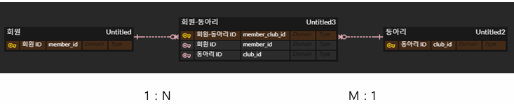
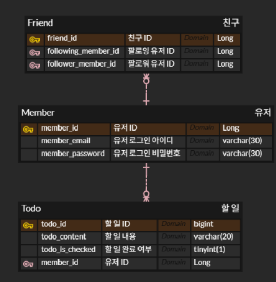
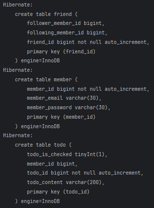

- **빈** : 공동으로 사용할 **하나의 객체**
- **스프링 컨테이너** : 빈을 저장하는 **공용 공간**
- **의존성 주입** : 필요한 객체를 **전달 받아서 사용**하는 것

- 컨테이너에 빈을 저장하는 방법 : 설정 파일 / **컴포넌트 스캔**
- 컨테이너에서 빈을 주입받는 방법 : **생성자 주입** / 필드 주입

## DB 설계

**개체(Entity)** : 문제 상황을 구성하는 요소 (ex 사람)  
**관계(Relationship)** : 개체와 개체 사이의 관계 (ex 친구)  
**속성(Attribute)** : 개체와 관계가 가지는 특징 (ex 이름, 나이 / 시작된 연도)  
**PK(Primary Key)** : 하나의 객체를 식별할 수 있는 속성

ER(Entity-Relationship) Model : 문제 상황을 개체와 관계로 표현하는 방법  
ERD : ER 모델을 다이어그램으로 표현한 것 -> ERD 통해 DB 설계

- 개체 -> 테이블
- 관계 -> 테이블/외래키
- 속성 -> 테이블 column

### 관계

1:1, 1:N, N:1, N:M

ex) 1:N 관계 -> **외래키(FK)**로 구현 (N:1 관계는 뒤집어서)  
  
ex) N:M -> **테이블**로 구현 (ex 회원(1:N)-동아리(1:M))  


- 관계에 대한 PK : 회원-동아리 ID
- 외래키 : 회원 ID, 동아리 ID

**식별 관계** : 관계 대상의 PK를 자신의 PK로도 사용하는 것  
**비-식별 관계** : 관계 대상의 PK를 자신의 FK로만 사용하는 것

## JPA (Java Persistence API)

데이터베이스에서 읽어온 데이터를 자바 객체로 매핑하는 자바의 표준 기술 (ORM)  
= _DB와 자바 객체 매핑 도구_

**Entity** : 자바와 데이터베이스 소통 단위 (_DB와 매핑되는 자바 객체_)  
테이블의 데이터 하나(레코드)는 entity 객체 하나로 매핑

엔티티 클래스 정의  
-> JPA가 엔티티 클래스 정의를 보고 **테이블 생성 SQL**을 알아서 작성/실행  
-> **CRUD SQL**도 알아서 작성/실행  
=> SQL 작성 시간 줄임  
(_JPA 사용하여 엔티티 클래스로 테이블 정의 가능_)

### 의존성 추가

```java
// build.gradle 파일
dependencies {
	implementation 'org.springframework.boot:spring-boot-starter-data-jpa'
    ..
   	implementation 'com.h2database:h2'
    runtimeOnly 'mysql:mysql-connector-java'
}
```

### DB 연결 정보 추가

스프링 부트 파일 설정 파일 : src > main > application.properties  
-> data 접속 정보 작성, 확장자 .yml로 변경

### 설정 파일 작성

스프링 부트는 기본적으로 H2 in-memory DB 사용 (휘발적)  
DB에 저장된 데이터를 볼 수 있도록 관리자 콘솔 활성화, 관리자 콘솔에 접속할 url 명시

```yml
# application.yml 파일
spring:
  application:
    name: todo-api

  datasource: # 관리자 콘솔에 접속할 url (설정 X -> 매번 랜덤 url 생성)
    url: jdbc:h2:mem:todo;MODE=MYSQL # h2를 MYSQL처럼 사용

  h2: # 관리자 콘솔 활성화 (기본값 false)
    console:
      enabled: true

  jpa:
    show-sql: true # JPA가 생성한 SQL 표시
    properties:
      hibernate:
        format_sql: true # 보기 좋게 들여쓰기 적용
        dialect: org.hibernate.dialect.MySQL8Dialect # SQL 생성 시, MYSQL8 문법 사용
```

## Entity 클래스

```java
// src > main > java > com.example.todo_api > todo > Todo.java
..
@Entity
public class Todo {
    @Id                 // DB에서 PK로 사용 (기본키) 명시
    @GeneratedValue(strategy = GenerationType.IDENTITY)   // 생성된 값 넣어줌 (ID 자동 생성값)
    @Column(name = "todo_id")
    private long id;    // 데이터 식별 위한 PK

    @Column(name = "todo_content", columnDefinition = "varchar(200)")
    private String content;

    @Column(name = "todo_is_checked", columnDefinition = "tinyInt(1)")
    private boolean isChecked;
}

// src > main > java > com.example.todo_api > member > Member
..
@Entity
public class Member {
    @Id
    @GeneratedValue(strategy = GenerationType.IDENTITY)
    @Column(name = "member_id")
    private Long id;

    @Column(name = "member_email", columnDefinition = "varchar(30)")
    private String email;

    @Column(name = "member_password", columnDefinition = "varchar(30)")
    private String password;
}
```

엔티티 클래스 : 테이블  
클래스 필드 : 컬럼

**@Entity** : 클래스가 엔티티임 명시  
**@Id** : 이 필드가 PK라는 것 명시

id값은 데이터 생성마다 자동으로 1씩 늘어남  
**@GeneratedValue** : id 값 자동 생성, strategy = IDENTITY로 설정 (키 값 결정을 DB에 위임)

**@Column** : ERD의 Column 이름과 타입 맞춤

### 외래키

외래키 컬럼
: Long 타입의 외래키 필드 대신, 해당 엔티티 타입의 entity 객체를 필드로 가지도록 설계

- 외래키 직접 저장  
  -> 관련 데이터 필요 시, 외래키로 데이터 조회 코드 **직접 작성** 필요
- 엔티티로 외래키 저장  
  : 테이블 만들 때 외래키 만들어줌  
  -> 관련 데이터 필요 시, **자동으로 join 쿼리 실행**

```java
// src > main > java > com.example.todo_api > todo > Todo.java
..
@Entity
public class Todo {
    ..
    // 외래키 컬럼
    @JoinColumn(name = "member_id")
    @ManyToOne(fetch = FetchType.LAZY)
    private Member member;
}

```

외래키 필드에 필요한 어노테이션

- **@JoinColumn** : 외래키(FK) 컬럼 정보 명시 (컬럼 이름 ..)
- **@ManyToOne**, _@OneToOne_, @OneToMany, @ManyToMany : 외래키로 생기는 연관관계 종류  
  @ManyToMany : 외래키 대신 테이블로 구현 -> 사용 X  
  @OneToMany : 양방향 매핑에 사용

연관관계 종류 나타내는 어노테이션의 **fetch** 속성

- 연결된 엔티티를 언제 가져올 지 명시
- EAGER : 즉시 로딩 (Todo 객체 정보 가져올 때, 연결된 User 객체의 모든 정보 함께 한 번에 가져옴)
- **LAZY** : 지연 로딩 (Todo 객체 정보 가져올 때, 연결된 User 객체의 정보 필요 시에만 가져옴)

### Entity 생성자

엔티티 객체 생성 시 생성자 만듦  
alt + insert -> id를 제외한 필드에 대한 생성자 추가  
(id 값은 자동으로 생성되므로 생성자에 포함 X)

```java
// Todo.java
..
@Entity
@Getter
@NoArgsConstructor(access = AcessLevel.PROTECTED)
public class Todo{
    ..
    // 생성자
    public Todo(String content, boolean isChecked, Member member){
        this.content = content;
        this.isChecked = isChecked;
        this.member = member;
    }
}
```

JPA는 entity 객체를 다룰(사용) 때, public/protected의 **인자 없는 생성자** 필요  
**@NoArgsConstructor** : 인자 없는 생성자 만듦 (access 속성 -> 접근 제한자 protected로 설정)  
Entity 객체에 **@Getter** 추가 -> 모든 필드에 getter 만듦  
&nbsp;

---

### 과제

erd  


관리자 콘솔  

