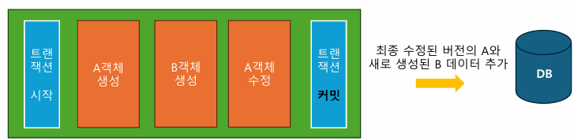
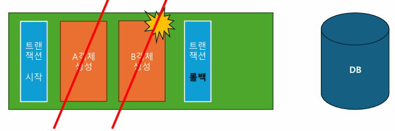
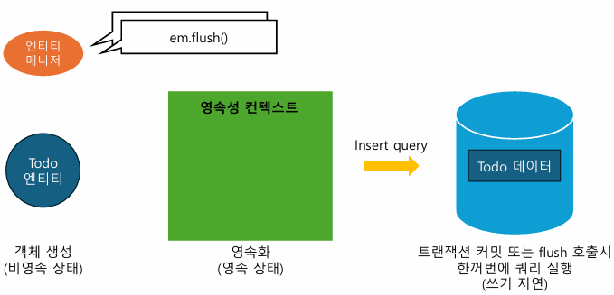
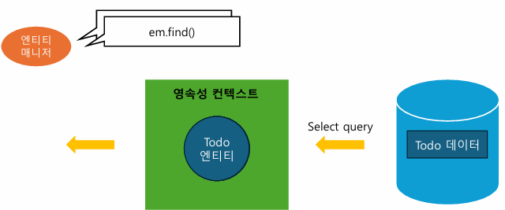
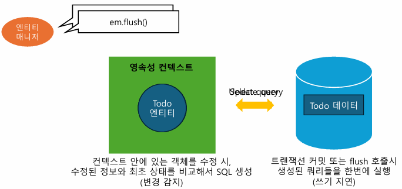
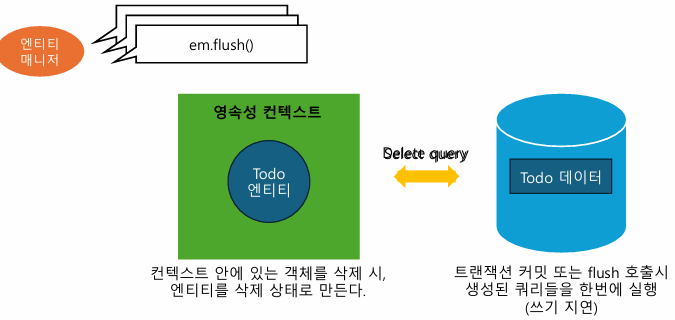

- ERD : DB 구조 설계
- JPA : 자바 객체(엔티티)와 DB 매핑 도구
- 엔티티 : JPA가 DB와 소통하는 데이터 단위
  - 엔티티 클래스 = 데이터베이스의 테이블 설계
  - 엔티티 클래스의 객체 = 그 테이블에 들어가는 데이터 하나에 매핑

## 레포지토리 계층

DB와 소통하며 데이터를 조작하는 계층  
서비스 계층이 결정한 비즈니스 로직을 실제 DB에 적용

### CRUD

- 생성 (Create)
- 조회 (Read)
- 수정 (Update)
- 삭제 (Delete)

JPA가 제공하는 기능 이용하여 구현

### 엔티티 매니저

스프링 어플리케이션과 데이터베이스 간의 직접적인 소통을 대신 해주는 객체 (우리 대신 DB와 직접 소통하는 객체)

- JPA는 application.yml 정보를 통해 **Entity Manager** 생성

새로 생성한 엔티티 객체를 DB에 **추가**  
DB에서 **조회**한 데이터로 엔티티 객체 만들기  
엔티티 객체에 대한 **수정**, **삭제** DB에 반영

### 트랜잭션

데이터 조작 행위들에 대한 쪼갤 수 없는 큰 동작 단위 (@transactional)

- JPA는 DB와 유사하게 트랜잭션 단위로 동작
- 트랜잭션이 끝나면 모든 변경사항을 DB에 반영
  
  **쓰기 지연** : 변경 발생마다 매번 DB에 쓰는게 아니라, 변경점들을 다 모아서 한 번에 지연해서 쓰기 실행

- 트랜잭션 중간에 에러 발생 -> 트랜잭션 범위 내 모든 변경점 되돌림 (**롤백**)  
  

## 영속성 컨텍스트

스프링 어플리케이션과 데이터베이스 사이에 존재하는 임시 엔티티 보관 공간  
: 엔티티 매니저는 변경 사항을 모았다가, 한 번에 SQL 생성  
: 모든 변경 사항은 영속성 컨텍스트에 저장  
-> 엔티티 매니저에게 데이터 변경 요청 = 엔티티 객체(데이터)를 영속성 컨텍스트에 올려두고 영속성 컨텍스트에 올려둔 엔티티 객체 변경

- DB에서 조회한 엔티티를 캐싱(임시 보관)
- JPA가 DB에 반영할 엔티티의 모든 변경 사항을 보관 (일종의 버퍼)
- 엔티티에 대한 변경 사항을 영속성 컨텍스트에 저장 -> 트랜잭션 커밋 -> 영속성 컨텍스트를 기반으로 한 번에 SQL 생성 (저장된 모든 변경점이 DB에 반영)

### 엔티티 저장

하나의 데이터 = 하나의 엔티티 객체  
엔티티 클래스의 생성자를 통해 새로운 객체 생성  
: 새로운 할 일 생성 = 새로운 Todo 객체(엔티티) 생성

**비영속 상태** : 엔티티(Todo) 객체 만들기만 하고, 아직 영속성 콘텍스트에 넣지 않은 상태

**em.persist()**  
: 영속성 컨텍스트에 신규 엔티티 객체 등록  
: 엔티티 -> 영속 컨텍스트에 등록 (영속화 = 영속 상태)  
: 트랜잭션 커 시 DB에도 데이터 추가 (DB를 영속성 컨텍스트와 동기화)

**em.flush()** : 영속성 컨텍스트 내 모든 변경 사항 DB에 반영 (쓰기 지연)



### 엔티티 조회

**em.find()**  
: 데이터베이스에서 엔티티 객체 조회  
: 자동으로 _Select query_ 만들어 줌  
: DB에서 읽어온 데이터를 가지고 엔티티 객체 매니저를 만들어서 영속성 컨텍스트에 저장  
  
2번째 조회 시에 DB에 쿼리 보내지 않고 영속성 컨텍스트에서 가져옴 (1차 캐시, 동일 객체 보장)

### 엔티티 수정

조회한 엔티티 객체 트랜잭션 내에서 수정하면 트랜잭션 끝날 때 알아서 반영  
: 수정할 데이터 DB에서 영속성 컨텍스트에 가져옴 (em.find()\__Select query_)  
: 수정된 정보와 최초 상태 비교하여 자동으로 SQL 생성 (변경 감지) -> 트랜잭션이 끝날 때 엔티티가 자동으로 _Update query_ 생성


### 엔티티 삭제

**em.remove()**  
: 영속성 컨텍스트 내 엔티티에 삭제 표시  
: 삭제할 데이터 DB에서 영속성 컨텍스트에 가져옴 (em.find()\__Select query_)
: em.remove() 호출 -> 삭제 상태 됨  
: 트랜잭션 종료 시, 삭제 상태로 표시된 변경 사항들 모두 *Delete query*로 만들어서 실제 DB에 반영  


&nbsp;

## 실습

### 레포지토리 계층

```java
// com.example.todo_api > todo > TodoRepository.java
...
@Repository     // 레포지토리로 동작하는 빈
public class TodoRepository{
    @PersistenceContext     // (영속성 컨텍스트에 접근할) 엔티티 매니저 객체 받아옴
    private EntityManager em;

    // 할 일 (데이터/객체) 생성
    public void save(Todo todo){
        em.persist(tood);
    }

    // 조회
    // 단건 조회
    public Todo findById(Long todoId){    // PK = 데이터 조회 기준
      return em.find(Todo.class, todoId); // find(가져올 곳= 엔티티 클래스, 가져오려고 하는 데이터의 PK 값)
    }
    // 다건 조회
    public List<Todo> findAll(){
      return em.createQuery("select t from Todo as t", Todo.class).getResultList();   // 쿼리 작성 필요 (jpql문 쿼리, 투두 객체에 대한 결과)
    }
    // 조건 조회
    public List<Todo> findAllByMember(Member member){
      return em.createQuery("select t from Todo as t where t.member = :todo_member", Todo.class)
        .setParameter("todo_member", member)   // todo_member 파라미터에 메서드에서 받아온 member 넘기겠다
        .getResultList();
    }

    // 삭제
    public void deleteById(Long todoId){
      Todo todo = findById(todoId);
      em.remove(todo);
    }

    // TEST 용도
    public void flushAndClear(){
      em.flush();   // 누적 사항 반영
      em.clear();   // 반영했으니까 영속성 컨텍스트 비우기
    }
}
```

레포지토리는 빈으로 등록하여 사용 -> **@Repository** 사용  
(내부적으로 @Component 적용되어 컴포넌트 스캔 시 빈으로 등록됨)

(조건조회) : todo_member  
: -> todo_member라고 하는 이름의 변수 (jpql 내부에서 사용되는 변수-외부에서 지정 필요)

**레포지토리 테스트**

```java
// test > .. > todo > TodoRepositoryTest.java
...
@SpringBootTest(webEnvironment = SpringBootTest.WebEnvironment.DEFINED_PORT)  // 어플리케이션 실행 시 미리 준비된 8080 포트 사용하여 테스트
public class TodoRepositoryTest{
    @Autowired
    private TodoRepository todoRepository;  // 테스트할 레포지토리 빈 주입 받음
    @Autowired
    private MemberRepository memberRepository;

    // 생성 테스트
    @Test
    @Transactional    // JPA 사용 코드는 모두 transaction 내애서 발생
    @Rollback(false)    // 수동으로 롤백 꺼줌
    void todoSaveTest(){
        // 트랜잭션 시작
        Todo todo = new Todo("todo content", false, null);  // todo 객체 생성

        // 트랜잭션 종료 => 커밋
        // 에러 발생 시 자동으로 출력

        Assertions.assertThat(todo.getId()).isNotNull();
        // 테스트 환경 기준, 에러 발생 않아도 테스트 끝나면 자동 롤백
    }
    // in memory database (테스트 끝 -> 어플리케이션 종료 -> DB 사라짐)

    // 단건 조회 테스트
    @Test
    @Transactional
    void todoFindOneByIdTest(){
      // given (기본 테스트 환경)
      Todo todo = new Todo("todo content", false, null);
      todoRepository.save(todo);

      // when (테스트할 행위)
      Todo findTodo = todoRepository.findById(todo.getId());

      // then (행위의 결과)
      Assertions.assertThat(findTodo.getId()).isEqualTo(todo.getId());
    }
    // 다건 조회 테스트
    @Test
    @Transactional
    void todoFindAllTest(){
      Todo todo1 = new Todo("todo content1", false, null);
      Todo todo2 = new Todo("todo content2", false, null);
      Todo todo3 = new Todo("todo content3", false, null);
      todoRepository.save(todo1);
      todoRepository.save(todo2);
      todoRepository.save(todo3);
    }
    // 조건 조회 테스트
    @Test
    @Transactional
    void todoFindAllByMemberTest(){
      Member member1 = new Member();
      Member member2 = new Member();
      memberRepository.save(member1);
      memberRepository.save(member2);

      Todo todo1 = new Todo("todo content1", false, member1);
      Todo todo2 = new Todo("todo content2", false, member2);
      Todo todo3 = new Todo("todo content3", false, member3);
      todoRepository.save(todo1);
      todoRepository.save(todo2);
      todoRepository.save(todo3);

      List<Todo> member1TodoList = todoRepository.findAllByMember(member1);
      List<Todo> member2TodoList = todoRepository.findAllByMember(member2);

      Assertions.assertThat(member1TodoList).hasSize(2);
      Assertions.assertThat(member2TodoList).hasSize(1);
    }

    // 수정 테스트
    @Test
    @Transactional
    @Rollback(false)  // DB에서 데이터 변경 확인
    void todoUpdateTest(){
      /*데이터 생성*/
      Todo todo1 = new Todo("todo content1", false, null);  // content 수정이라 member 상관 X (null)
      todoRepository.save(todo1);

      todoRepository.flushAndClear(); // 영속성 컨텍스트 비움
      /*없어도 됨*/

      Todo findTodo1 = todoRepository.findById(todo1.getId());  // 조회
      findTodo1.updateContent("new Content"); // 수정
    }

    // 삭제 테스트
    @Test
    @Transactional
    @Rollback(false)
    void todoDeleteTest(){
      Todo todo1 = new Todo("todo content1", false, null);
      Todo todo2 = new Todo("todo content2", false, null);
      todoRepository.save(todo1);
      todoRepository.save(todo2);

      todoRepository.flushAndClear();

      todoRepository.deleteById(todo1.getId());
    }

    @AfterAll   // 모든 테스트 끝난 뒤 실행 메서드
    public static void doNotFinish(){   // 메소드 실행
        System.out.println("test finished");
        while(true){}       // 무한 반복 => 프로그램 실행 종료 X
    }
}
```

```java
// com.example.todo_api > member > MemberRepository.java (조건조회)
..
@Repository
public class MemberRepository{
  @PersistenceContext
  private EntityManager em;

  public void save(Member member){
    em.persist(member);
  }
}

```

```java
// com.example.todo_api > todo > Todo.java (할 일 수정)
  ...
  // 할 일 수정 (private이라 변경 X -> public하게 접근해서 수정하는 메서드)
  public void updateContent(String newContent){
    this.content = newContent;
  }
```

실제 DB와 통신하면서 데이터 넣으려면 테스트 시에도 스프링 부트 실행 필요  
(테스트 용도의 가짜 웹 환경이 아닌 실제 웹 환경 띄워 테스트\_8080 포트)

어플리케이션 종료되지 않도록 반복문 추가

### 할 일 생성

**@Transactional** : 엔티티 매니저 사용 시, 트랜잭션 안에서 사용 필요 (메서드 범위에서 트랜잭션 시작, 커밋, 롤백 알아서 처리)  
**@Rollback(value=false)** : 테스트 환경에서는 하나의 테스트가 끝나면 자동으로 롤백해서 DB 되돌림 -> DB에 데이터 생성 확인을 위해 롤백 하지 않도록 설정

Assertions : 코드 검증 (todo_id != null -> 객체 생성 0) = 객체 생성 = id 값 자동 생성

### 할 일 조회

**단건 조회** **em.find()**  
: 영속성 컨텍스트에서 데이터 조회  
: 영속성 컨텍스트에 데이터 없다면 DB에서 읽어옴

**다건 조회**, **조건 조회** **em.createQuery()**  
: 여러 개 조회 -> 직접 쿼리 작성  
: JPA에서는 DB에서 사용하는 SQL 대신, 객체에 대한 쿼리인 JPQL 사용  
(flushAndClear 안 해도 selectQuery 나옴)

_SQL vs JPQL_  
select \* from todo // (todo = 테이블)  
select t from Todo as t // (todo = 엔티티) (todo 클래스 객체 t로 지칭(as t), 객체(t) select)

select \* from todo as t where t.user_id = @user_id // @ 사용 (user_id로 비교)  
select t from Todo as t where t.user = :user // : 을 붙여 jpql 내부에서 사용할 변수 이름 지정 (t.user = :user -> 엔티티 객체 직접 비교)

### 할 일 수정

수정할 할 일 조회 -> 트랜잭션 안에서 객체 수정 -> 트랜잭션 끝날 때 엔티티 매니저가 수정 사항 반영  
: 도메인 엔티티 클래스 계층에서 처리 (엔티티 클래스의 필드 수정 메소드 작성)  
: 데이터 변경을 DB에서 확인해야 하므로 @Rollback 추가

### 할 일 삭제

**em.remove()**  
: 영속성 컨텍스트에 엔티티 올려두고, 해당 데이터 삭제 상태로 변경

&nbsp;

## 과제

유저 회원가입을 할 때 CRUD 중 필요한 것 -> Create  
유저 로그인을을 할 때 CRUD 중 필요한 것 -> Read (조회)  
특정 친구의 todo list 보려면 작성해야 할 JPQL
->

반복적인 작업 자동화 -> **spring data JPA** 적용
